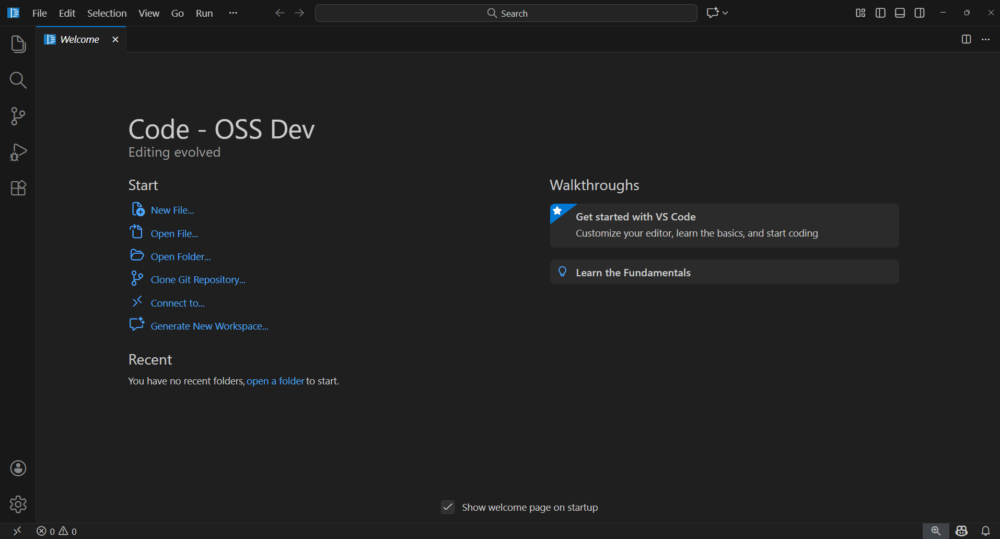
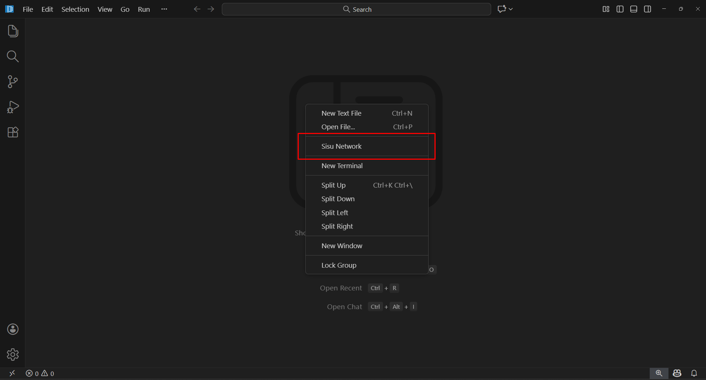
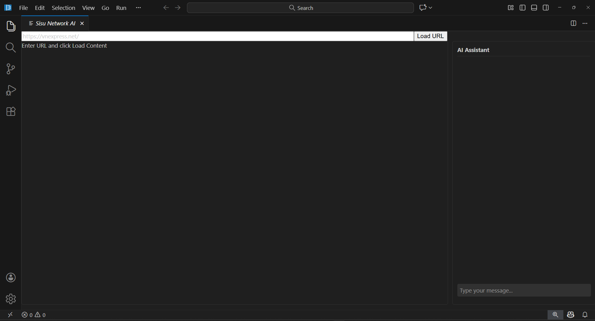

## Yêu cầu môi trường (Windows10/11)

Trước khi chạy dự án, cần đảm bảo đã cài đặt:

- **Node.js** (phiên bản >= 20)
- **npm** (đi kèm Node.js)
- **Python 3** (dùng cho build nội bộ của VSCode) cần phải cài node-gyp **node-gyp**
- **Visual Studio Build Tools** (Windows, hỗ trợ biên dịch native modules)
  - MSVC v143 - VS 2022 C++ x64/x86 Spectre-mitigated libs (Latest)
  - C++ ATL for latest build tools with Spectre Mitigations
  - C++ MFC for latest build tools with Spectre Mitigations

## Các hệ điều hành khác hoặc chi tiết các requirement trên xem ở link dưới

- **Tham khảo chi tiết** [(Windows, hỗ trợ biên dịch native modules)](https://github.com/microsoft/vscode/wiki/How-to-Contribute)

---

## Cách chạy dự án

1. Cài đặt các gói cần thiết:
   ```bash
   npm install
   ```
2. Cài đặt các gói cần thiết:
   ```bash
   npm run watch
   ```
3. Chạy vscode
   ```bash
   .\scripts\code.bat
   ```

## Cách sử dụng

Sau khi đã chạy được CODE-OSS, sẽ có màn hình welcome, tắt màn hình đó và bấm chuột phải để mở menu

Click vào Sisu Network

Màn hình gồm có input nhập url web và 2 component

